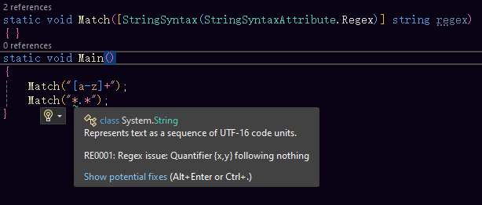

# How to use

This library contains a plethora of features that allow you to manipulate with or generate text. They are intended to improve your productivity and accelerate your text generation.

The following features are available in `Textify.Data`:


[name-generation.md](name-generation.md)



[unicode-analysis.md](unicode-analysis.md)



[word-management.md](word-management.md)



[figlet-text.md](figlet-text.md)


The following features are available in the base Textify library:


[space-analysis-and-correction.md](space-analysis-and-correction.md)



[semantic-versioning.md](semantic-versioning.md)



[accessibility-tools.md](accessibility-tools.md)


For general usage of the text manipulation library, you can use the `TextTools` class to get access to various string manipulators. This class is found in the `Textify.General` namespace. Additionally, the JSON tools can be found in the `JsonTools` class to get access to various JSON tools, such as getting a difference between two JSON objects.

In addition to the general text tools, you can also use the regular expression tools found under the `Textify.Tools` namespace.

## String syntax attribute

First introduced in .NET 7, you can use the string syntax attribute, called `StringSyntaxAttribute`, to give your strings in the function context, but it's only available in the source code level. This depends on your IDE and how it supports this attribute.

Here's a simple example of how to use it:

```csharp
public static bool IsValidRegex([StringSyntax(StringSyntaxAttribute.Regex)] string pattern) =>
    IsValidRegex(new Regex(pattern));
```

You can use this syntax attribute in not only .NET 7.0+ apps, but you can also use it in .NET Standard and .NET Framework applications.


When trying to use this attribute in .NET 7.0+ apps while using Textify, you'll notice this error message appearing in the error list:

```
The type 'StringSyntaxAttribute' exists in both 'Textify, Version=x.x.x.x, Culture=neutral, PublicKeyToken=21c82ea14d2d7748' and 'System.Runtime, Version=8.0.0.0, Culture=neutral, PublicKeyToken=b03f5f7f11d50a3a'
```

This is intentional, because Visual Studio only highlights the string based on context defined by this attribute when it is found in the `System.Diagnostics.CodeAnalysis` namespace.

To solve this error, you must make an alias of the `Textify.Offline` NuGet package by clicking on the Properties button in the right-click menu of the package and writing `global, TextifyAlias` to the `Aliases` property. Then, write the extern alias statement at the top of the source code file and modify the `using` statement for the `CodeAnalysis` namespace, such as:

```csharp
extern alias TextifyAlias;
using TextifyAlias::System.Diagnostics.CodeAnalysis;
```

After that, you should be able to use this attribute.


If everything works properly, you should be able to see that parts of your string, such as regex in the below screenshot, are highlighted in different colors, and warnings should work, too.

<figure><figcaption></figcaption></figure>

## Unicode character width

For applications that need to deal with the Unicode character width as in console cells, we've introduced this fine feature from Terminaux that allows you to query a Unicode character for its width, such as modifier characters that take up zero console cells (i.e. zero width characters), English letters that take up one cell (i.e. half-width characters), and Chinese characters that take up two cells (i.e. full-width characters).


Please note that this information doesn't indicate the string length either by the amount of UTF-8 characters or by the text element as `StringInfo` class returns. This indicates how many console grid cells a character or a sentence consumes. For example, when an application tries to get the string length that contains zero-width or full-width characters, it doesn't indicate the number of cells, but the number of absolute characters, so Chinese characters are considered as one character that takes up two cells and Arabic modifier characters are considered as one character that takes up zero cells. If you want to measure the correct string length as how it would show up on a console, you should use this feature. The easiest way to use it is to rely on Terminaux's character extensions.

