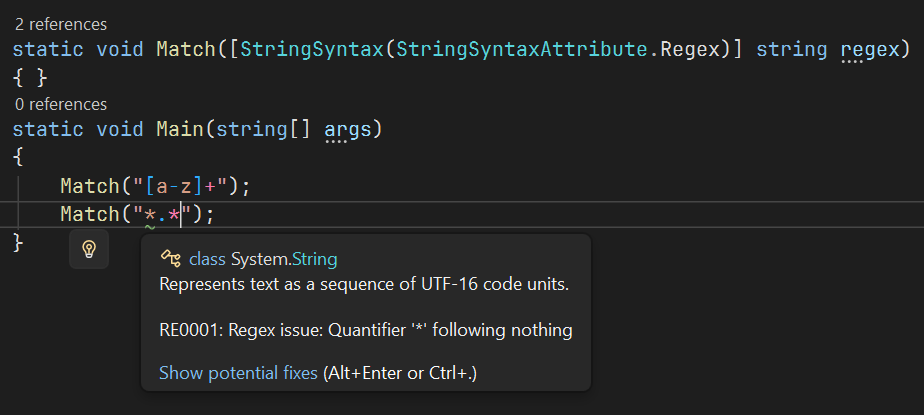

# String Syntax Attribute

First introduced in .NET 7, you can use the string syntax attribute, called `StringSyntaxAttribute`, to give your strings in the function context, but it's only available in the source code level. This depends on your IDE and how it supports this attribute.

Here's a simple example of how to use it:

```csharp
public static bool IsValidRegex([StringSyntax(StringSyntaxAttribute.Regex)] string pattern) =>
    IsValidRegex(new Regex(pattern));
```

You can use this syntax attribute in not only .NET 7.0+ apps, but you can also use it in .NET Standard and .NET Framework applications.


When trying to use this attribute in .NET 7.0+ apps while using Textify, you'll notice this error message appearing in the error list:

```
The type 'StringSyntaxAttribute' exists in both 'Textify, Version=x.x.x.x, Culture=neutral, PublicKeyToken=21c82ea14d2d7748' and 'System.Runtime, Version=8.0.0.0, Culture=neutral, PublicKeyToken=b03f5f7f11d50a3a'
```

This is intentional, because Visual Studio only highlights the string based on context defined by this attribute when it is found in the `System.Diagnostics.CodeAnalysis` namespace.

To solve this error, you must make an alias of the `Textify.Offline` NuGet package by clicking on the Properties button in the right-click menu of the package and writing `global, TextifyAlias` to the `Aliases` property. Then, write the extern alias statement at the top of the source code file and modify the `using` statement for the `CodeAnalysis` namespace, such as:

```csharp
extern alias TextifyAlias;
using TextifyAlias::System.Diagnostics.CodeAnalysis;
```

After that, you should be able to use this attribute.


If everything works properly, you should be able to see that parts of your string, such as regex in the below screenshot, are highlighted in different colors, and warnings should work, too.

<figure><figcaption></figcaption></figure>
